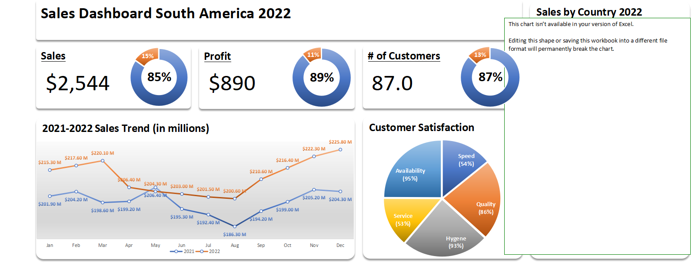

The MacDonald's Sales 2022 Dashboard provides an in-depth analysis of sales, profits, customers, and satisfaction metrics in the fast-food industry.

This project was built using Microsoft Excel, leveraging:

Data Cleaning

Data Transformation

Interactive Visualization

The dashboard delivers actionable insights for decision-making, helping businesses improve profitability, customer experience, and regional sales performance.

📈 Key Insights
1. Sales, Profit, and Customers Analysis

Sales: $2,544

Profit: $890

Customers: 87
Offers a holistic view of financial performance and customer engagement.

2. 2021-2022 Sales Trend

Year-over-year performance comparison.

Identifies growth and decline patterns for strategic planning.

3. Customer Satisfaction Breakdown

Speed: 54%

Quality: 86%

Hygiene: 93%

Service: 53%

Availability: 95%
Helps identify areas for service improvement.

4. Sales by Country (2022)

Regional performance segmentation.

Supports targeted marketing and operations.

🛠 Tools & Techniques Used

Microsoft Excel

Power Query for data cleaning

Pivot Tables for aggregations

Charts & Slicers for interactivity

Data Visualization Best Practices

📂 Project Structure
📁 MacDonalds_Sales_2022_Dashboard
 ├── 📄 MacDonalds_Sales_2022.xlsx     # Main dashboard file
 ├── 📁 images
 │    └── Dashboard.png                # Dashboard screenshot
 └── 📄 README.md                      # Project documentation

🚀 How to Use

Download the .xlsx file from this repository.

Open in Microsoft Excel (latest version recommended).

Use filters and slicers to explore sales and customer insights.

🎯 Impact

This dashboard empowers business teams to:

Detect high and low performing regions

Improve customer satisfaction

Plan data-driven marketing strategies

Enhance profitability

Author: Muhammad Adnan